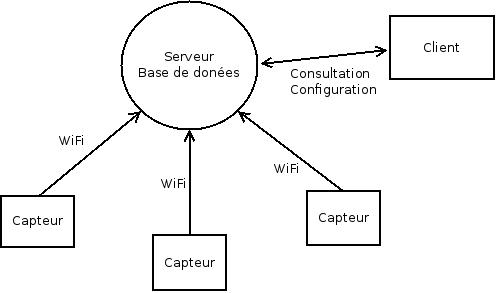

# Projet 42 : Smart Sensor Wifi
*Binôme Thomas Maurice - Benoit Maliar, IMA4SC*

## Énoncé initial du projet
L'objectif du projet consiste en la conception et la réalisation de
capteurs autonomes communiquant en WiFi afin de pouvoir remonter
régulièrement des informations sur l'état des salles de cours.
Les capteurs seront par exemple des détecteurs de lumières,
de pression, de qualité de l'air, ...

La communication sera obligatoirement réalisée en WiFi sur le réseau
de l'université en respectant les contraintes de sécurité (WPA2, ...).

Deux options sont possibles :

 * Refaire complètement une carte avec un microcontroleur et une puce wifi
 (comme par exemple les [spark](https://www.spark.io/))
 * Réaliser un shield pour raspberry pi contenant les différents capteurs. 

## Analyse rapide du sujet
On a ici affaire à un réseau de capteurs reliés à une base de donnée centrale
qui est chargée d'interroger régulièrement les différents capteurs de manière
à pouvoir présenter à un utilisateur un état des différentes pièces dans
lesquelles on aura disposé les capteurs. Cela peut notemment impliquer :

 * Un accès à ces données via une interface web
 * Un accès à ces données via une application mobile
 * Un accès à ces données via un programme desktop
 
On identifie donc deux parties au projet :

 * La partie capteur
 * La partie serveur

Et on déduis donc l'architecture suivante :

## Cahier des charges
### Spécifications des capteurs
Les caractéristiques souhaitées pour les capteurs sont :

 * Être capable de mesurer l'environnement dans lequel évolue le capteur
   (Pression, température, lumière, présence, ouverture de porte...)
 * Contacter le seuveur via le WiFi pour actualiser la base.
 * Éventuellement, être reconfigurable à distance.
 

### Spécifications du serveur
Les caractéristiques souhaitées pour le serveur sont :

 * Être capable de contacter ou d'être contacté par les capteurs via le réseau.
 * Respecter les contraintes de sécurité (WPA2)
 * Être capable d'authentifier les clients
 * Stocker les données reçues dans une base de données et éventuellement
   faire des calculs et des statistiques sur ces données.
 * Présenter sous format compréhensibles les données au client (web ou appli)
 * Vérifier l'état des capteurs et notifier un responsable en cas d'anomalie
   (déconnexion du réseau, valeur anormale d'un capteur...)
